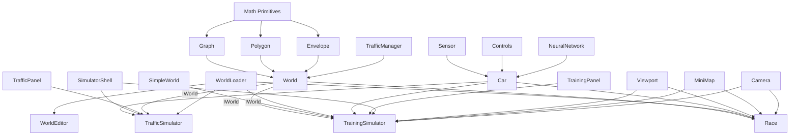

# Project Architecture

## Overview

The Self-Driving Car project is a browser-based autonomous vehicle simulation platform. It demonstrates neuroevolution — evolving neural networks through genetic algorithms to produce cars that learn to navigate procedurally-generated environments.

**Key architectural principles:**

- Zero runtime dependencies — everything implemented from scratch
- No bundler — TypeScript compiles to JS, HTML loads scripts via `<script>` tags
- Global scope — all classes exist as window globals; HTML controls dependency order
- Canvas 2D rendering with custom 3D projection for camera views

---

## Build Pipeline

```
┌──────────────┐     ┌─────────┐     ┌──────────────┐     ┌─────────┐
│  ts/*.ts     │────▶│  tsc    │────▶│  js/*.js     │────▶│ Browser │
│  (source)    │     │ compiler│     │  (output)    │     │ <script>│
└──────────────┘     └─────────┘     └──────────────┘     └─────────┘
```

- `tsc --watch` recompiles on save
- `serve -p 9090` serves the root directory as static files
- HTML files reference `/js/...` paths directly in ordered `<script>` tags
- No import/export at runtime — all code attaches to global scope

### Script Load Order (Dependency Hierarchy)

All HTML pages follow a strict dependency hierarchy to ensure modules load before their dependencies reference them. The order is organized by layer:

```html
<!-- Layer 1: Core Math & Primitives (Foundation — no dependencies) -->
<script src="/js/math/primitives/point.js"></script>
<script src="/js/math/primitives/segment.js"></script>
<script src="/js/math/primitives/polygon.js"></script>
<script src="/js/math/primitives/envelope.js"></script>
<script src="/js/math/utils.js"></script>
<script src="/js/math/graph/graph.js"></script>
<script src="/js/math/spatialGrid.js"></script>

<!-- Layer 2: World System (depends on math primitives) -->
<script src="/js/world/corridor.js"></script>
<script src="/js/world/generation/worldGenerator.js"></script>
<script src="/js/world/items/tree.js"></script>
<script src="/js/world/items/building.js"></script>
<script src="/js/world/markings/marking.js"></script>
<script src="/js/world/markings/stop.js"></script>
<script src="/js/world/markings/start.js"></script>
<script src="/js/world/markings/crossing.js"></script>
<script src="/js/world/markings/parking.js"></script>
<script src="/js/world/markings/light.js"></script>
<script src="/js/world/markings/target.js"></script>
<script src="/js/world/markings/yield.js"></script>
<script src="/js/world/editors/markingEditor.js"></script>
<script src="/js/world/editors/graphEditor.js"></script>
<script src="/js/world/editors/stopEditor.js"></script>
<script src="/js/world/editors/startEditor.js"></script>
<script src="/js/world/editors/crossingEditor.js"></script>
<script src="/js/world/editors/parkingEditor.js"></script>
<script src="/js/world/editors/lightEditor.js"></script>
<script src="/js/world/editors/targetEditor.js"></script>
<script src="/js/world/editors/yieldEditor.js"></script>
<script src="/js/world/trafficManager.js"></script>
<script src="/js/world/world.js"></script>
<script src="/js/world/simple/simpleWorld.js"></script>
<script src="/js/world/loader/worldLoader.js"></script>

<!-- Layer 3: Rendering & Viewport (depends on math) -->
<script src="/js/camera/types.js"></script>
<script src="/js/camera/extrusion.js"></script>
<script src="/js/camera/camera.js"></script>
<script src="/js/viewport/scaleIndicator.js"></script>
<script src="/js/viewport/viewport.js"></script>
<script src="/js/mini-map/miniMap.js"></script>

<!-- Layer 4: Audio (standalone) -->
<script src="/js/audio/sound.js"></script>

<!-- Layer 5: Core Utilities & Car System (depends on math + world) -->
<script src="/js/utils.js"></script>
<script src="/js/car/sensors/sensor.js"></script>
<script src="/js/car/controls/controls.js"></script>
<script src="/js/car/car.js"></script>
<script src="/js/car/loader/carLoader.js"></script>

<!-- Layer 6: Neural Network (depends on core utilities) -->
<script src="/js/neural-network/visualizer.js"></script>
<script src="/js/neural-network/network.js"></script>

<!-- Layer 7: Storage & Data Management (before simulators) -->
<script src="/js/store/types.js"></script>
<script src="/js/store/storeManager.js"></script>

<!-- Layer 8: UI Panel Templates (before custom elements) -->
<script src="/js/panels/templates/worldToolbarTemplate.js"></script>
<script src="/js/simulator/panels/templates/layoutToolbarTemplate.js"></script>
<script src="/js/simulator/panels/templates/animationLoopToolbarTemplate.js"></script>
<script src="/js/panels/templates/shortcutsToolbarTemplate.js"></script>
<script src="/js/simulator/training/templates/trainingPanelTemplate.js"></script>
<script src="/js/simulator/training/templates/trainingInitModalTemplate.js"></script>

<!-- Layer 9: UI Components/Panels (custom elements) -->
<script src="/js/panels/worldToolbar.js"></script>
<script src="/js/simulator/panels/layoutToolbar.js"></script>
<script src="/js/simulator/panels/animationLoopToolbar.js"></script>
<script src="/js/panels/shortcutsToolbar.js"></script>

<!-- Layer 10: Training & Simulator-Specific Modules (depends on everything) -->
<script src="/js/simulator/training/modes/trafficFactory.js"></script>
<script src="/js/simulator/training/modes/borderCollision.js"></script>
<script src="/js/simulator/training/rendering/carRenderer.js"></script>
<script src="/js/simulator/training/rendering/layoutManager.js"></script>
<script src="/js/simulator/training/modes/simpleModeBehavior.js"></script>
<script src="/js/simulator/training/modes/worldModeBehavior.js"></script>
<script src="/js/simulator/training/genetics/storageManager.js"></script>
<script src="/js/simulator/training/genetics/poolManager.js"></script>
<script src="/js/simulator/training/trainingInitModal.js"></script>
<script src="/js/simulator/training/trainingPanel.js"></script>

<!-- Layer 11: Simulator Core (final orchestrator) -->
<script src="/js/simulator/core/simulatorShell.js"></script>
<script src="/js/simulator/training/trainingSimulator.js"></script>

<!-- Layer 12: Inline Initialization (after all modules loaded) -->
<script>
  (async () => {
    await StoreManager.init();
    const simulator = new TrainingSimulator(
      canvas,
      networkCanvas,
      miniMapCanvas,
    );
  })();
</script>
```

**Critical Rules:**

1. **Core features first**: Math, World, and Rendering layers must load before any modules that use them
2. **Templates before components**: UI templates must load before custom elements that reference them
3. **Storage initialized early**: `StoreManager` must be available before simulators start
4. **Global scope only**: No import/export at runtime; all classes attach to `window`
5. **Add to all HTML files**: When adding new modules, update all relevant HTML files (`simulator.html`, `traffic.html`, `race.html`, `world.html`) with consistent ordering

**HTML files affected:**

- `html/simulator.html` — Training simulator
- `html/traffic.html` — Live traffic simulation
- `html/race.html` — Racing game
- `html/world.html` — World editor

---

## Module Dependency Graph



---

## Core Modules

### 1. Mathematical Foundations (`ts/math/`)

The geometric engine powering all spatial operations.

| Module                   | Responsibility                                                |
| ------------------------ | ------------------------------------------------------------- |
| `primitives/point.ts`    | 2D/3D position, drawing, equality checks                      |
| `primitives/segment.ts`  | Line segments, projection, distance, direction vectors        |
| `primitives/polygon.ts`  | Closed shapes, union, intersection, containment (ray casting) |
| `primitives/envelope.ts` | Rounded rectangles around segments (road surfaces)            |
| `graph/graph.ts`         | Point/segment network, Dijkstra shortest path                 |
| `osm-importer/osm.ts`    | OpenStreetMap JSON → Point/Segment conversion                 |
| `utils.ts`               | Vector math, lerp, intersections, rotation, distance          |

### 2. Car System (`ts/car/`)

Vehicle physics, perception, and control abstraction.

| Module                       | Responsibility                                        |
| ---------------------------- | ----------------------------------------------------- |
| `car.ts`                     | Physics simulation, polygon collision, AI integration |
| `sensors/sensor.ts`          | Ray-casting, obstacle detection, normalized readings  |
| `controls/controls.ts`       | Keyboard input, AI/DUMMY modes                        |
| `controls/phoneControls.ts`  | Device orientation (accelerometer tilt)               |
| `controls/cameraControls.ts` | Webcam-based marker steering                          |
| `controls/markerDetector.ts` | K-means blue pixel clustering for markers             |

### 3. Neural Network (`ts/neural-network/`)

The AI brain and its visualization.

| Module          | Responsibility                                        |
| --------------- | ----------------------------------------------------- |
| `network.ts`    | Feedforward network, Level class, mutation, crossover |
| `visualizer.ts` | Real-time rendering of activations, weights, biases   |

### 4. World Editor (`ts/world/`)

Environment generation and interactive editing.

| Module                         | Responsibility                                               |
| ------------------------------ | ------------------------------------------------------------ |
| `world.ts`                     | World class structure, properties, draw, static loader       |
| `generation/worldGenerator.ts` | Procedural road/lane/separator/building/tree generation      |
| `corridor.ts`                  | Standalone drivable-path object (authored or on-the-fly)     |
| `trafficManager.ts`            | Traffic light cycling and intersection coordination          |
| `types.ts`                     | Editor-specific type declarations (IWorld, etc.)             |
| `editors/worldEditor.ts`       | Master editor coordinator                                    |
| `editors/graphEditor.ts`       | Road network point/segment manipulation (one-way + hard-sep) |
| `editors/corridorEditor.ts`    | Authors corridor world objects (start→end, tunnel mode)      |
| `editors/markingEditor.ts`     | Base class for all marking placement tools                   |
| `editors/*Editor.ts`           | Specialized editors (light, stop, start, target, etc.)       |
| `items/building.ts`            | 3D building rendering with perspective                       |
| `items/tree.ts`                | Procedural multi-level tree with noisy canopy                |
| `markings/*.ts`                | Traffic marking types (start, stop, light, crossing, etc.)   |

### 5. Simulators & Training (`ts/simulator/training/`, `ts/world/simple/`)

Training environments and genetic algorithm orchestration.

| Module                        | Responsibility                                                                 |
| ----------------------------- | ------------------------------------------------------------------------------ |
| `trainingPanel.ts`            | Custom element: training UI + genetic algorithm orchestration + car generation |
| `trainingSimulator.ts`        | Unified simulator: world mode (default) + simple mode (`?mode=simple`)         |
| `genetics/poolManager.ts`     | Pure functions for car creation, brain application, pool sorting               |
| `genetics/storageManager.ts`  | localStorage persistence: load/save/discard/legacy migration                   |
| `modes/trafficFactory.ts`     | Traffic row generation for simple mode                                         |
| `modes/simpleModeBehavior.ts` | Simple-mode update loop: traffic spawning, car updates, idle detection         |
| `modes/borderCollision.ts`    | Collision response: push cars back onto road instead of stopping               |
| `rendering/layoutManager.ts`  | Canvas resize logic for multi-panel layout                                     |
| `rendering/carRenderer.ts`    | Simulator-specific car drawing: pool highlighting, name labels, layering       |
| `templates/`                  | HTML template strings for custom elements                                      |

### 5a. Reusable Simulator Core (`ts/simulator/core/`, `ts/simulator/traffic/`)

Scaffolding shared by every canvas-based simulator, plus the Live Traffic Jam
simulator built on it.

| Module                        | Responsibility                                                                                                                                                             |
| ----------------------------- | -------------------------------------------------------------------------------------------------------------------------------------------------------------------------- |
| `core/simulatorShell.ts`      | Abstract base class: canvases/contexts, viewport/camera/mini-map, panel refs, responsive layout, network visualizer, and the render-throttled `requestAnimationFrame` loop |
| `traffic/trafficSimulator.ts` | Live Traffic Jam: loads a world, spawns self-driving cars on click, car-vs-car collision with “ghosting” of wrecks                                                         |
| `traffic/trafficPanel.ts`     | Custom element `<traffic-panel>`: per-car list (swatch, status, speed, distance, read-only config) + select/remove/clear/pause controls                                    |
| `traffic/templates/`          | HTML template strings for the traffic panel                                                                                                                                |

Both `TrainingSimulator` (`ts/simulator/training/trainingSimulator.ts`) and `TrafficSimulator` extend
`SimulatorShell`, which owns the generic, non-domain scaffolding so each
simulator only implements its own `update()` / `draw()` behaviour.

### 5b. Reusable Loaders (`ts/world/loader/`, `ts/car/loader/`)

| Module                        | Responsibility                                               |
| ----------------------------- | ------------------------------------------------------------ |
| `world/loader/worldLoader.ts` | Reusable file-input handler for loading `.world` files       |
| `car/loader/carLoader.ts`     | Reusable file-input handler for loading `.car`/`.json` files |

### 6. Viewport & Rendering (`ts/viewport/`, `ts/mini-map/`, `ts/camera/`)

| Module                 | Responsibility                                                   |
| ---------------------- | ---------------------------------------------------------------- |
| `viewport/viewport.ts` | Zoom, pan, coordinate transformation (2D top-down)               |
| `mini-map/miniMap.ts`  | Scaled overview of world graph and car positions                 |
| `camera/types.ts`      | Camera interfaces (`ICameraPoint`, `ICameraRenderOptions`, etc.) |
| `camera/extrusion.ts`  | 3D extrusion helpers (buildings, cars, trees)                    |
| `camera/camera.ts`     | Frustum-based perspective projection & 3D rendering              |

### 7. Games, Audio & Utilities (`ts/games/`, `ts/audio/`, `ts/`)

| Module           | Responsibility                                    |
| ---------------- | ------------------------------------------------- |
| `games/race.ts`  | Racing with countdown, progress, AI opponents     |
| `audio/sound.ts` | Audio synthesis (beep, explosion, ta-daa fanfare) |
| `utils.ts`       | `polysIntersect`, `getRGBA`, `getRandomColor`     |
| `types.ts`       | Global type/interface declarations                |

### 8. UI Panels (`ts/panels/` + `ts/simulator/panels/`)

| Module                    | Tag                        | Responsibility                                                                |
| ------------------------- | -------------------------- | ----------------------------------------------------------------------------- |
| `worldToolbar.ts`         | `<world-toolbar>`          | File I/O, border/tracking mode, camera debug toggle                           |
| `layoutToolbar.ts`        | `<layout-toolbar>`         | Layout toggle, camera/network/minimap visibility                              |
| `animationLoopToolbar.ts` | `<animation-loop-toolbar>` | Play/pause + render-interval (animation loop control)                         |
| `shortcutsToolbar.ts`     | `<shortcuts-toolbar>`      | Per-page keyboard-shortcut indicators (momentary flash + click-latch toggles) |

> `worldToolbar.ts` lives in the shared `ts/panels/` directory (not the
> simulator domain) because it is reused by the simulator, race, Live Traffic
> Jam, and World Editor pages. Its World group exposes editor-only Save /
> Dispose / OSM-Import buttons (revealed via `showWorldEditorActions()`), and
> simulator-only groups (Car, Borders, Tracking, Debug) are hidden in the editor
> via `hideGroups(...)`. `layoutToolbar.ts` and `animationLoopToolbar.ts` remain
> in `ts/simulator/panels/`. `shortcutsToolbar.ts` also lives in the shared
> `ts/panels/` directory and is used by the World Editor, Live Traffic Jam, and
> Training Simulator pages; each page calls `setShortcuts(defs)` with only the
> keys it uses. Toggle indicators (`O` one-way, `R` reverse heading) are
> click-latchable; the owner keeps the latch state (effective = latched OR
> key-held).

> All three floating toolbars are grouped inside the `#simulatorToolbar` flex
> container (top of the page, panels left-to-right with a gap). The pause state
> and `renderInterval` are owned by `<animation-loop-toolbar>` and read by
> `SimulatorShell` — shared across both the training and Live Traffic Jam pages.

> The `<world-toolbar>` also hosts the **Spawn Car** picker (🚕 dropdown), shown
> only on the Live Traffic Jam page via `showSpawnCarPicker()`. It selects which
> stored/loaded car configuration is painted onto the road on the next click.

---

## Data Flow

### Training Loop (Per Frame)

```
Sensor.update()
    │
    ▼
rays[] ──intersect──▶ roadBorders, buildings, traffic cars
    │
    ▼
readings[] (normalized 0-1 offsets, closer = higher value)
    │
    ▼
NeuralNetwork.feedForward(readings + speed)
    │
    ▼
outputs[4] (binary: forward, left, right, reverse)
    │
    ▼
Car.#move() ── physics update ──▶ new position/angle
    │
    ▼
Car.#assessDamage() ── polygon intersection ──▶ damaged?
    │                                            │
    ▼ (if borderMode === 'collision')            │
handleCollisionWithRoadBorders() ── push back    │
    │                                            │
    ▼                                            ▼
TrainingManager.updateBestCarAndPool()    car stops (dead)
    │
    ▼
fitness = distance traveled along corridor/road
```

### Generation Cycle

```
1. trainingManager.initializeCars()
   → createCarsForTraining(count, type, config, startInfo)  [poolManager.ts]
2. applyPoolToCars(cars, pool, mutationRate)                [poolManager.ts]
   → First K cars: exact copies from pool (elitism)
   → Rest: crossover(random parent1, random parent2) + mutate(rate)
3. onCarsCreated(cars) callback → simulator refreshes borders, camera, etc.
   (cars are passed into `world.draw()` / `camera.render()` at draw time)
4. animate() loop → all cars drive simultaneously
5. Cars crash → marked damaged, stop updating (or bounce back in collision mode)
6. User action:
   - "Next Gen" (🧬) → getTopCarInfoPool() → saves top K → initializeCars()
   - "New Train" (🔄) → clears pool → initializeCars() from scratch
7. "Save" (💾) → savePoolToStorage(topK) → localStorage["bestPool"]
```

---

## Persistence Layer

### LocalStorage Keys

| Key                 | Content                                             | Format            |
| ------------------- | --------------------------------------------------- | ----------------- |
| `bestPool`          | Array of top-performing car configs with brains     | JSON `CarInfo[]`  |
| `raceCars`          | Cars loaded via the race "Load car(s)" button       | JSON `CarInfo[]`  |
| `editorWorld`       | World saved by the world editor                     | JSON world object |
| `store:activeWorld` | Active store world id (`store:`/`loaded:`/`editor`) | string            |
| `store:activeCar`   | Active store car ids (multi-select)                 | JSON `string[]`   |

> The legacy `world` key is migrated to `editorWorld` once on init. See
> [Save & Load](SaveLoad.md) for the full persistence schema.

> The race composes its grid from `bestPool` (read-only) + active store cars +
> `raceCars`, applying each car as-is with **no mutation** (mutation is
> training-only). The race "Load car(s)" button writes `raceCars`, never `bestPool`.

**Legacy keys** (auto-migrated to `bestPool` on first load):

| Key           | Content                             |
| ------------- | ----------------------------------- |
| `bestBrain`   | Single top-performing NeuralNetwork |
| `bestBrains`  | Array of top K networks             |
| `bestCarInfo` | CarInfo object (physics + sensors)  |

### File System (`saves/`)

| Extension | Content                                             | Example                  |
| --------- | --------------------------------------------------- | ------------------------ |
| `.world`  | Complete world state (graph, roads, markings, zoom) | `big_with_target.world`  |
| `.car`    | Car configuration as JSON (`CarInfo` with brain)    | `right_hand_rule.car`    |
| `.json`   | Raw OpenStreetMap data for import                   | `ashkelon-osm-data.json` |

---

## HTML Entry Points

| File             | Key Modules                                                    | Purpose                          |
| ---------------- | -------------------------------------------------------------- | -------------------------------- |
| `index.html`     | None (static links only)                                       | Landing page with mode selection |
| `simulator.html` | Full stack + SimpleWorld + TrafficFactory + SimpleModeBehavior | AI training (both modes)         |
| `race.html`      | Full stack + Race + Sound + WorldLoader + CarLoader + Controls | All race modes via URL params    |
| `world.html`     | World + Editors + Viewport + WorldLoader + OSM importer        | Map creation & editing           |

---

## Type System

### Global Interfaces (`ts/types.ts`)

```typescript
declare let carInfo: CarInfo | undefined; // From .car file inline scripts
declare let world: World | undefined; // From .world file inline scripts
```

### IWorld Interface (`ts/world/types.ts`)

```typescript
interface IWorld {
  graph: Graph;
  markings: Marking[];
  roadBorders: Segment[];
  corridors: Corridor[];
  buildings: Building[];
  trees: Tree[];
  zoom?: number;
  offset?: Point;
  generateCorridor(start: Point, end: Point): void;
  draw(ctx: CanvasRenderingContext2D, options: WorldDrawOptions): void;
}

interface WorldDrawOptions {
  viewPoint: Point;
  cars?: Car[]; // Cars to render (draw-time input, not world state)
  bestCar?: Car | null; // Highlighted car drawn with its sensor rays
  showStartMarkings?: boolean;
  renderRadius?: number;
  carAlpha?: number;
  showCarNames?: boolean;
}

// Corridor is a class in ts/world/corridor.ts (not an interface):
class Corridor {
  borders: Segment[]; // For collision detection
  skeleton: Segment[]; // For progress measurement
  openStart: boolean; // Start cap removed (open / tunnel)
  openEnd: boolean; // End cap removed (open / tunnel)
}
```

---

## Design Patterns

| Pattern                    | Usage                                                                                |
| -------------------------- | ------------------------------------------------------------------------------------ |
| **Custom HTML Elements**   | UI panels self-contain template, DOM queries, event listeners, and public state      |
| **Composition**            | Cars contain Sensors, Controls, and NeuralNetworks as separate objects               |
| **Static factory methods** | `World.load()`, `Graph.load()`, `Marking.load()` for deserialization                 |
| **Painter's algorithm**    | 3D objects sorted by distance and drawn back-to-front                                |
| **Genetic pool breeding**  | Top K parents produce offspring via random crossover + mutation                      |
| **Ray casting**            | Sensor perception and point-in-polygon containment testing                           |
| **Envelope wrapping**      | Roads generated by wrapping graph segments in rounded polygons, then unioning        |
| **Interface polymorphism** | `IWorld` lets TrainingSimulator/Camera work with both `World` and `SimpleWorld`      |
| **Spatial filtering**      | Binary-search or Manhattan-distance to reduce per-car collision checks               |
| **Pure functions**         | `poolManager.ts`, `trafficFactory.ts` — stateless logic extracted from UI components |

---

## Performance Considerations

The simulator is tuned to run very large populations (tens of thousands of cars)
without the physics loop stalling. Optimizations fall into three buckets:
**spatial filtering**, **allocation-free hot loops**, and **render/UI decoupling**.

### Spatial Filtering (Critical for Large Populations)

With thousands of cars, each needing ray-intersection and collision against road
borders every frame, a naive O(cars × rays × segments) is prohibitive.

| Mode   | Strategy                                                                   | Effective reduction  |
| ------ | -------------------------------------------------------------------------- | -------------------- |
| Simple | Traffic sorted by Y; binary-search for cars within ±400px                  | ~100→5 per car       |
| World  | Spatial Hash Grid broad phase + exact per-car narrow-phase distance filter | full map→~10 per car |

The world-mode grid query radius is derived from `sensor.rayLength`, so it scales
with each car's actual reach (see `updateWorldCars` in [Simulators](Simulators.md)
and the [Spatial Hash Grid](Math.md#spatial-hash-grid-tsmathspatialgridts)).

### Allocation-Free Hot Loops (GC Reduction)

Per-frame garbage was a major source of minor-GC pauses at scale. The hot paths
were rewritten to allocate nothing per car/ray/segment:

- **Sensor `#getReading`** — single pass tracking the closest offset (no per-ray
  array/`map`/spread/`find`), builds the hit point once for the winner.
- **`getIntersectionOffset`** — number-returning intersection used by the sensor
  and `polysIntersect`, replacing the `{x,y,offset}` object in boolean/offset-only
  contexts.
- **`polysIntersect` + AABB pre-filter** — `#assessDamage` rejects far obstacles
  with a bounding-box test before any edge math, and the 2-point border duplicate
  edge is skipped.
- **`SpatialHashGrid.query`** — index buckets + an `Int32Array` stamp for dedup,
  eliminating a per-query `Set`.
- **Top-K pool selection** — `getTopAICars` picks the best `poolSize` cars in one
  partial-selection pass instead of `filter` + full `sort` of the whole
  population every frame.

### Rendering & UI Decoupling

- **Render throttle**: physics steps every animation frame, but the draw pass
  runs once per `renderInterval` frames (user-adjustable in the
  animation-loop-toolbar panel). Heavy frames no longer drag the simulation rate down — the picture
  updates less often, training throughput is unchanged.
- **Batched alpha + per-car transform**: regular cars set `globalAlpha` once for
  the whole batch and draw their sprite via a manual transform inverse instead of
  paying a `save`/`restore` pair each — removing ~2 context-state ops per car.
- **Throttled panel DOM**: the pool table (`innerHTML` rebuild) and status dots
  (a `localStorage` read) refresh ~4×/sec instead of every frame.
- **Viewport culling**: cars outside the visible X/Y bounds are skipped entirely.
- **Camera frustum**: triangular polygon clips world geometry before projection.
- **Mini-map**: uses a pre-scaled graph (×0.05) rather than full geometry.
- **Cached mask sprites**: pre-composited color sprites drawn with a single
  `drawImage` (see [Simulators](Simulators.md)).

> **Note:** none of these change simulation _behavior_. Brains, mutation,
> crossover, fitness, sensing results, and collision outcomes are identical —
> only speed changed. Saved `.car` brains load and run exactly as before.

---

## Code Conventions

| Convention               | Rule                                                                                                                        |
| ------------------------ | --------------------------------------------------------------------------------------------------------------------------- |
| Formatting               | Prettier with `singleQuote: true`                                                                                           |
| Class naming             | PascalCase (`NeuralNetwork`, `SimpleWorld`)                                                                                 |
| Function/variable naming | camelCase (`createCarsForTraining`, `roadBorders`)                                                                          |
| Private members          | `#` prefix (ES2022 private fields)                                                                                          |
| Serialization            | `static load(info)` factory + instance `toInfo()` method                                                                    |
| Drawing                  | Each class owns its `draw(ctx, options?)` method; options are typed interfaces (`CarDrawOptions`, `WorldDrawOptions`, etc.) |
| Templates                | HTML template strings in `templates/` subdirectories                                                                        |
| Custom elements          | `connectedCallback()` renders template, `configure()` binds                                                                 |
