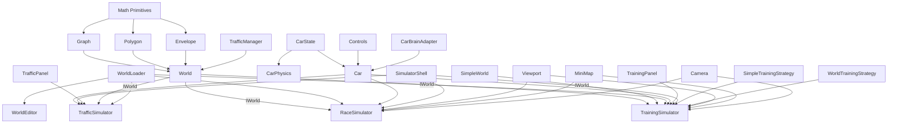

# Project Architecture

## Overview

The Self-Driving Car project is a browser-based autonomous vehicle simulation platform. It demonstrates neuroevolution — evolving neural networks through genetic algorithms to produce cars that learn to navigate procedurally-generated environments.

**Key architectural principles:**

- Zero runtime dependencies — everything implemented from scratch
- No bundler — native ES modules via `<script type="module">`
- ES module imports/exports — all files use `module: "nodenext"` with `.js` import extensions
- Canvas 2D rendering with custom 3D projection for camera views

---

## Build Pipeline

```
┌──────────────┐     ┌─────────┐     ┌──────────────┐     ┌─────────────────┐
│  ts/*.ts     │────▶│  tsc    │────▶│  js/*.js     │────▶│ Browser         │
│  (source)    │     │ compiler│     │  (output)    │     │ <script type=   │
│  import/export│    │         │     │  import/export│    │  "module">      │
└──────────────┘     └─────────┘     └──────────────┘     └─────────────────┘
```

- `tsc --watch` recompiles on save
- `serve -p 9090` serves the root directory as static files
- Each HTML page loads exactly one `<script type="module" src="/js/path/to/entry.js">`
- The browser resolves the import graph at runtime — no manual dependency ordering needed

### Import Path Convention

TypeScript `module: "nodenext"` requires `.js` extensions in import paths, even though the source file is `.ts`:

```typescript
// In ts/world/world.ts:
import { Point } from '../math/primitives/point.js'; // resolves to point.ts
import { Segment } from '../math/primitives/segment.js'; // resolves to segment.ts
import { Graph } from '../math/graph/graph.js';
import { Envelope } from '../math/primitives/envelope.js';
```

### Entry Points

| Page                       | Entry module                                           |
| -------------------------- | ------------------------------------------------------ |
| `html/simulator.html`      | `ts/simulator/entry.ts`                                |
| `html/traffic.html`        | `ts/traffic/entry.ts`                                  |
| `html/race.html`           | `ts/race/entry.ts`                                     |
| `html/world.html`          | `ts/world/entry.ts`                                    |
| `html/human-training.html` | `ts/simulator/humanTraining/humanBackpropSimulator.ts` |
| `index.html`               | `ts/store/entry.ts`                                    |

### Dependency Graph (Import Order)

The module dependency graph is a DAG. Each file `import`s only from lower layers:

```
math/primitives (Point, Segment, Polygon, Envelope)
  → math/utils (lerp, distance, etc.)
  → math/graph (Graph)
  → math/spatialGrid, math/osm-importer
  → rendering (drawPoint, drawSegment, drawPolygon, drawEnvelope)
  → world: items, markings, editors, corridor, trafficManager
  → world/world, world/simple/simpleWorld, world/loader
  → camera, viewport, mini-map
  → audio
  → car: config, carState, sensorRaycaster, sensors, controls, physics
  → car/brain (CarBrainAdapter — sole bridge to NeuralNetwork)
  → car/car, car/loader
  → neural-network
  → store
  → panels: templates, custom elements (world-toolbar, layout-toolbar, etc.)
  → simulator: spatialGridUtils, training modes, genetics, panels
  → simulator/core (SimulatorShell)
  → simulator/training/trainingSimulator
  → simulator/traffic/trafficSimulator
  → simulator/racing/raceSimulator
  → simulator/humanTraining/humanBackpropSimulator
  → entry points (import everything needed and bootstrap)
```

**Critical Rules:**

1. **No circular imports** — The graph must remain acyclic. If a cycle appears, extract shared types into a new file.
2. **Import from `.js` files** — TypeScript for `nodenext` needs the `.js` extension in import paths.
3. **Single entry per page** — All dependencies are reachable via the import graph from one entry point.
4. **`StoreManager.init()`** is called at the top of each entry module — it fetches bundled assets before the app boots.

---

## Module Dependency Graph



---

## Core Modules

### 1. Mathematical Foundations (`ts/math/`)

The geometric engine powering all spatial operations.

| Module                   | Responsibility                                                                                                                                                |
| ------------------------ | ------------------------------------------------------------------------------------------------------------------------------------------------------------- |
| `primitives/point.ts`    | 2D/3D position, equality checks                                                                                                                               |
| `primitives/segment.ts`  | Line segments, projection, distance, direction vectors                                                                                                        |
| `primitives/polygon.ts`  | Closed shapes, union, intersection, containment (ray casting)                                                                                                 |
| `primitives/envelope.ts` | Rounded rectangles around segments (road surfaces)                                                                                                            |
| `graph/graph.ts`         | Point/segment network, Dijkstra shortest path                                                                                                                 |
| `osm-importer/osm.ts`    | OpenStreetMap JSON → Point/Segment conversion                                                                                                                 |
| `spatialGrid.ts`         | Uniform spatial hash grid for fast range queries over segments                                                                                                |
| `trafficControlGrid.ts`  | Spatial hash grid (150px cells) indexing `Light` polygons for AI traffic-light perception; rebuilt on markings change, state read live via `getState` closure |
| `heatmapGrid.ts`         | Lazy grid-based congestion counter for the spatial heatmap overlay                                                                                            |
| `utils.ts`               | Vector math, lerp, intersections, rotation, distance                                                                                                          |

### 2. Car System (`ts/car/`)

Vehicle physics, perception, and control abstraction. The main `Car` class is an
orchestrator — motion, collision, rendering, and AI control mapping are delegated
to focused collaborators.

| Module                       | Responsibility                                                                                                                                                                |
| ---------------------------- | ----------------------------------------------------------------------------------------------------------------------------------------------------------------------------- |
| `config.ts`                  | Default car configuration (`maxSpeed`, `acceleration`, etc.)                                                                                                                  |
| `car.ts`                     | Orchestrator: sensor, brain, physics, renderer, controls, audio callbacks                                                                                                     |
| `physics/carPhysics.ts`      | Motion (speed + translation), polygon creation, damage assessment. Steering (angle) handled by Car directly                                                                   |
| `physics/sensorRaycaster.ts` | Pure ray generation and intersection logic                                                                                                                                    |
| `rendering/carRenderer.ts`   | Sprite caching, mask compositing, draw (color/name/sensors)                                                                                                                   |
| `carState.ts`                | `CarState` + `ControlsState` interfaces (breaks circular deps)                                                                                                                |
| `brain/carBrainAdapter.ts`   | Sole bridge to NeuralNetwork: create, serialize, deserialize, feedforward; `inputLayerSize(rayCount, stateAware)` picks `rayCount*2+1` (state-aware) vs `rayCount+1` (legacy) |
| `sensors/sensor.ts`          | Ray-casting state, obstacle detection, unified `sensorReadings` array; optional `trafficControls` param + `stateAware` flag for traffic-light perception                      |
| `controls/controls.ts`       | Keyboard input, AI/DUMMY modes                                                                                                                                                |
| `controls/phoneControls.ts`  | Device orientation (accelerometer tilt)                                                                                                                                       |
| `controls/cameraControls.ts` | Webcam-based marker steering                                                                                                                                                  |
| `controls/markerDetector.ts` | K-means blue pixel clustering for markers                                                                                                                                     |

**Factory method**: `Car.fromInfo(opts, info?)` provides an explicit, deterministic
path for car rehydration from persisted `CarInfo`. The existing `load(info)`
mutation-based path is kept for backward compatibility.

### 3. Neural Network (`ts/neural-network/`)

The AI brain and its visualization.

| Module          | Responsibility                                        |
| --------------- | ----------------------------------------------------- |
| `network.ts`    | Feedforward network, Level class, mutation, crossover |
| `visualizer.ts` | Real-time rendering of activations, weights, biases   |

### 4. World Editor (`ts/world/`)

Environment generation and interactive editing.

| Module                         | Responsibility                                               |
| ------------------------------ | ------------------------------------------------------------ |
| `world.ts`                     | World class structure, properties, draw, static loader       |
| `generation/worldGenerator.ts` | Procedural road/lane/separator/building/tree generation      |
| `corridor.ts`                  | Standalone drivable-path object (authored or on-the-fly)     |
| `trafficManager.ts`            | Traffic light cycling and intersection coordination          |
| `types.ts`                     | Editor-specific type declarations (IWorld, etc.)             |
| `editors/worldEditor.ts`       | Master editor coordinator                                    |
| `editors/graphEditor.ts`       | Road network point/segment manipulation (one-way + hard-sep) |
| `editors/corridorEditor.ts`    | Authors corridor world objects (start→end, tunnel mode)      |
| `editors/markingEditor.ts`     | Base class for all marking placement tools                   |
| `editors/*Editor.ts`           | Specialized editors (light, stop, start, target, etc.)       |
| `items/building.ts`            | 3D building rendering with perspective                       |
| `items/tree.ts`                | Procedural multi-level tree with noisy canopy                |
| `markings/*.ts`                | Traffic marking types (start, stop, light, crossing, etc.)   |

### 5. Simulators & Training (`ts/simulator/training/`, `ts/world/simple/`)

Training environments and genetic algorithm orchestration.

| Module                        | Responsibility                                                                          |
| ----------------------------- | --------------------------------------------------------------------------------------- |
| `trainingPanel.ts`            | Custom element: training UI + genetic algorithm orchestration + car generation          |
| `trainingSimulator.ts`        | Strategy host: shared state + helpers, delegates per-mode behavior to a strategy object |
| `genetics/poolManager.ts`     | Pure functions for car creation, brain application, pool sorting                        |
| `genetics/storageManager.ts`  | localStorage persistence: load/save/discard/legacy migration                            |
| `modes/trafficFactory.ts`     | Traffic row generation for simple mode                                                  |
| `modes/simpleModeBehavior.ts` | `SimpleSimState` + pure update functions + `SimpleTrainingStrategy` class               |
| `modes/worldModeBehavior.ts`  | Pure `updateWorldCars()` function + `WorldTrainingStrategy` class                       |
| `modes/borderCollision.ts`    | Collision response: push cars back onto road instead of stopping                        |
| `rendering/carRenderer.ts`    | Simulator-specific car drawing: pool highlighting, name labels, layering                |
| `templates/`                  | HTML template strings for custom elements                                               |

### 5b. Shared Simulator Utilities (`ts/simulator/`)

Functions shared by all canvas-based simulators (TrainingSimulator, TrafficSimulator, RaceSimulator).

| Module                       | Responsibility                                                                                           |
| ---------------------------- | -------------------------------------------------------------------------------------------------------- |
| `spatialGridUtils.ts`        | `buildRoadBorders()`, `queryBordersNearCar()`, `pointToSegmentDistanceSq()`                              |
| `trafficControlUtils.ts`     | `buildTrafficControls(world)` + `queryTrafficControlsNearCar(grid, car)` for AI traffic-light perception |
| `rendering/layoutManager.ts` | Canvas resize logic for multi-panel layout                                                               |

### 5d. Reusable Simulator Core (`ts/simulator/core/`, `ts/simulator/traffic/`, `ts/simulator/racing/`)

Scaffolding shared by every canvas-based simulator, plus the concrete simulators
built on it (Live Traffic Jam, Racing).

| Module                        | Responsibility                                                                                                                                                                                       |
| ----------------------------- | ---------------------------------------------------------------------------------------------------------------------------------------------------------------------------------------------------- |
| `views/simulatorPageHost.ts`  | Lightweight host object carrying toolbar/panel refs, injected into `SimulatorShell` to decouple it from page-specific DOM queries                                                                    |
| `core/simulatorShell.ts`      | Abstract base class: canvases/contexts, viewport/camera/mini-map, panel refs (via `SimulatorPageHost`), responsive layout, network visualizer, and the render-throttled `requestAnimationFrame` loop |
| `traffic/trafficSimulator.ts` | Live Traffic Jam: loads a world, spawns self-driving cars on click, car-vs-car collision with “ghosting” of wrecks                                                                                   |
| `traffic/trafficPanel.ts`     | Custom element `<traffic-panel>`: per-car list (swatch, status, speed, distance, read-only config) + select/remove/clear/pause controls                                                              |
| `traffic/templates/`          | HTML template strings for the traffic panel                                                                                                                                                          |
| `racing/raceSimulator.ts`     | Racing mode: competitive race from Start to Target markings with AI opponents, corridor progress tracking, countdown                                                                                 |
| `racing/racePanel.ts`         | Race-specific DOM construction, statistics panel, restart button, countdown UI                                                                                                                       |

`TrainingSimulator` (`ts/simulator/training/trainingSimulator.ts`) extends
`SimulatorShell` and uses the **strategy pattern** — it detects the mode from the
URL parameter (`?mode=simple`) and delegates per-frame `update()` / `draw()` calls
to either a `SimpleTrainingStrategy` or `WorldTrainingStrategy` instance
(in `modes/simpleModeBehavior.ts` / `modes/worldModeBehavior.ts`). Mode-specific
state (`SimpleSimState`, `SpatialHashGrid`) lives in the strategies while shared
helpers (`getStartInfo`, `updateRoadBorders`, `openInitModal`, …) stay on
`TrainingSimulator`.

`TrafficSimulator` and `RaceSimulator` extend `SimulatorShell` directly.

### 5e. Reusable Loaders (`ts/world/loader/`, `ts/car/loader/`)

| Module                        | Responsibility                                               |
| ----------------------------- | ------------------------------------------------------------ |
| `world/loader/worldLoader.ts` | Reusable file-input handler for loading `.world` files       |
| `car/loader/carLoader.ts`     | Reusable file-input handler for loading `.car`/`.json` files |

### 6. Math Rendering (`ts/rendering/`)

Pure renderer functions extracted from math primitives to break the cross-cutting
dependency on Canvas 2D APIs. Each function accepts a primitive as data and an
options interface for style control.

| Module                | Responsibility                                                                    |
| --------------------- | --------------------------------------------------------------------------------- |
| `pointRenderer.ts`    | Draws `Point` as filled/outlined circles                                          |
| `segmentRenderer.ts`  | Draws `Segment` as styled lines with optional dash/cap                            |
| `polygonRenderer.ts`  | Draws `Polygon` as filled and stroked closed shapes                               |
| `envelopeRenderer.ts` | Draws `Envelope` by delegating to `drawPolygon`                                   |
| `heatmapRenderer.ts`  | Paints a `HeatmapGrid` as a viewport-culled colour overlay (blue→cyan→yellow→red) |

These are importable by any file that needs them (World, editors, markings) via
`import { drawPoint } from '../rendering/pointRenderer.js'`.

### 7. Viewport & Rendering (`ts/viewport/`, `ts/mini-map/`, `ts/camera/`)

| Module                 | Responsibility                                                   |
| ---------------------- | ---------------------------------------------------------------- |
| `viewport/viewport.ts` | Zoom, pan, coordinate transformation (2D top-down)               |
| `mini-map/miniMap.ts`  | Scaled overview of world graph and car positions                 |
| `camera/types.ts`      | Camera interfaces (`ICameraPoint`, `ICameraRenderOptions`, etc.) |
| `camera/extrusion.ts`  | 3D extrusion helpers (buildings, cars, trees)                    |
| `camera/camera.ts`     | Frustum-based perspective projection & 3D rendering              |

### 8. Racing, Audio & Utilities (`ts/simulator/racing/`, `ts/audio/`, `ts/`)

| Module                              | Responsibility                                                                                         |
| ----------------------------------- | ------------------------------------------------------------------------------------------------------ |
| `simulator/racing/raceSimulator.ts` | `RaceSimulator` — extends `SimulatorShell`; racing logic, car generation, countdown, corridor progress |
| `simulator/racing/racePanel.ts`     | `RacePanel` — DOM assembly, stats updates, toolbar wiring for the race page                            |
| `audio/sound.ts`                    | Audio synthesis (beep, explosion, ta-daa fanfare)                                                      |
| `math/collision.ts`                 | `polysIntersect` — edge intersection detection (moved from utils.ts)                                   |
| `math/color.ts`                     | `getRGBA`, `getRandomColor` (moved from utils.ts)                                                      |
| `store/serialization.ts`            | `safeJsonParse`, `stripFileExtension` (moved from utils.ts)                                            |
| `types.ts`                          | Global type/interface declarations                                                                     |

### 9. UI Panels (`ts/panels/` + `ts/simulator/panels/`)

The `<world-toolbar>` custom element was decomposed into smaller helper classes
for clarity — the main element remains as a composition root.

| Module                    | Tag                        | Responsibility                                                                |
| ------------------------- | -------------------------- | ----------------------------------------------------------------------------- |
| `worldToolbar.ts`         | `<world-toolbar>`          | Composition root: file I/O, border/tracking mode, camera debug toggle         |
| `modeControls.ts`         | —                          | `ToolbarModeControls` — border/tracking/viewport mode button wiring           |
| `assetSelectors.ts`       | —                          | `ToolbarAssetSelectors` — world/car picker popovers and file I/O binding      |
| `worldLayersToolbar.ts`   | `<world-layers-toolbar>`   | Per-layer visibility toggles + ♻️ Regenerate + 🌡️ heatmap overlay toggle      |
| `layoutToolbar.ts`        | `<layout-toolbar>`         | Layout toggle, camera/network/minimap visibility                              |
| `animationLoopToolbar.ts` | `<animation-loop-toolbar>` | Play/pause + render-interval (animation loop control)                         |
| `shortcutsToolbar.ts`     | `<shortcuts-toolbar>`      | Per-page keyboard-shortcut indicators (momentary flash + click-latch toggles) |

> `worldToolbar.ts` lives in the shared `ts/panels/` directory (not the
> simulator domain) because it is reused by the simulator, race, Live Traffic
> Jam, and World Editor pages. Its World group exposes editor-only Save /
> Dispose / OSM-Import buttons (revealed via `showWorldEditorActions()`), and
> simulator-only groups (Car, Borders, Tracking, Debug) are hidden in the editor
> via `hideGroups(...)`. `layoutToolbar.ts` and `animationLoopToolbar.ts` remain
> in `ts/simulator/panels/`. `shortcutsToolbar.ts` also lives in the shared
> `ts/panels/` directory and is used by the World Editor, Live Traffic Jam, and
> Training Simulator pages; each page calls `setShortcuts(defs)` with only the
> keys it uses. Toggle indicators (`O` one-way, `R` reverse heading) are
> click-latchable; the owner keeps the latch state (effective = latched OR
> key-held).

> All three floating toolbars are grouped inside the `#simulatorToolbar` flex
> container (top of the page, panels left-to-right with a gap). The pause state
> and `renderInterval` are owned by `<animation-loop-toolbar>` and read by
> `SimulatorShell` — shared across both the training and Live Traffic Jam pages.

> The `<world-toolbar>` also hosts the **Spawn Car** picker (🚕 dropdown), shown
> only on the Live Traffic Jam page via `showSpawnCarPicker()`. It selects which
> stored/loaded car configuration is painted onto the road on the next click.

---

## Data Flow

### Training Loop (Per Frame)

```
Sensor.update()
    │
    ▼
rays[] ──intersect──▶ roadBorders, buildings, traffic cars (as Point[][])
    │                  (+ trafficControls for cars with sensor.stateAware)
    │
    ▼
sensorReadings[] (unified SensorReading[]: { distance, state, type, x, y })
    │   (state-aware: each ray has distance + state; legacy: readings[] only)
    │
    ▼
NeuralNetwork.feedForward(distances [+ states] + speed)
    │
    ▼
outputs[4] (binary: forward, left, right, reverse)
    │
    ▼
CarPhysics.update() ── physics update ──▶ new position/speed
                                           (angle set by Car.#applySteering() beforehand)
    │
    ▼
CarPhysics.assessDamage() ── polygon intersection ──▶ damaged?
    │                                            │
    ▼ (if borderMode === 'collision')            │
handleCollisionWithRoadBorders() ── push back    │
    │                                            │
    ▼                                            ▼
TrainingManager.updateBestCarAndPool()    car stops (dead)
    │
    ▼
fitness = distance traveled along corridor/road
```

### Generation Cycle

```
1. trainingManager.initializeCars()
   → createCarsForTraining(count, type, config, startInfo)  [poolManager.ts]
2. applyPoolToCars(cars, pool, mutationRate)                [poolManager.ts]
   → First K cars: exact copies from pool (elitism)
   → Rest: crossover(random parent1, random parent2) + mutate(rate)
3. onCarsCreated(cars) callback → simulator refreshes borders, camera, etc.
   (cars are passed into `world.draw()` / `camera.render()` at draw time)
4. animate() loop → all cars drive simultaneously
5. Cars crash → marked damaged, stop updating (or bounce back in collision mode)
6. User action:
   - "Next Gen" (🧬) → getTopCarInfoPool() → saves top K → initializeCars()
   - "New Train" (🔄) → clears pool → initializeCars() from scratch
7. "Save" (💾) → savePoolToStorage(topK) → localStorage["bestPool"]
```

---

## Persistence Layer

### LocalStorage Keys

| Key                 | Content                                             | Format            |
| ------------------- | --------------------------------------------------- | ----------------- |
| `bestPool`          | Array of top-performing car configs with brains     | JSON `CarInfo[]`  |
| `raceCars`          | Cars loaded via the race "Load car(s)" button       | JSON `CarInfo[]`  |
| `editorWorld`       | World saved by the world editor                     | JSON world object |
| `humanTrainedCar`   | Human-backprop trained brain (single CarInfo)       | JSON `CarInfo`    |
| `store:activeWorld` | Active store world id (`store:`/`loaded:`/`editor`) | string            |
| `store:activeCar`   | Active store car ids (multi-select)                 | JSON `string[]`   |

> The legacy `world` key is migrated to `editorWorld` once on init. See
> [Save & Load](SaveLoad.md) for the full persistence schema.

> The race composes its grid from `bestPool` (read-only) + active store cars +
> `raceCars`, applying each car as-is with **no mutation** (mutation is
> training-only). The race "Load car(s)" button writes `raceCars`, never `bestPool`.

**Legacy keys** (auto-migrated to `bestPool` on first load):

| Key           | Content                             |
| ------------- | ----------------------------------- |
| `bestBrain`   | Single top-performing NeuralNetwork |
| `bestBrains`  | Array of top K networks             |
| `bestCarInfo` | CarInfo object (physics + sensors)  |

### File System (`saves/`)

| Extension | Content                                             | Example                  |
| --------- | --------------------------------------------------- | ------------------------ |
| `.world`  | Complete world state (graph, roads, markings, zoom) | `big_with_target.world`  |
| `.car`    | Car configuration as JSON (`CarInfo` with brain)    | `right_hand_rule.car`    |
| `.json`   | Raw OpenStreetMap data for import                   | `ashkelon-osm-data.json` |

---

## HTML Entry Points

| File                       | Key Modules                                                                                       | Purpose                          |
| -------------------------- | ------------------------------------------------------------------------------------------------- | -------------------------------- |
| `index.html`               | None (static links only)                                                                          | Landing page with mode selection |
| `simulator.html`           | Full stack + SimpleWorld + TrafficFactory + SimpleModeBehavior                                    | AI training (both modes)         |
| `race.html`                | Full stack + RaceSimulator + SimulatorShell + Sound + WorldLoader + CarLoader + Controls          | All race modes via URL params    |
| `world.html`               | World + Editors + Viewport + WorldLoader + OSM importer                                           | Map creation & editing           |
| `html/human-training.html` | Full stack + HumanBackpropSimulator + SimulatorShell + NetworkVisualizer + ConfigModal + Controls | Human Backpropagation training   |

---

## Type System

### Global Interfaces (`ts/types.ts`)

```typescript
declare let carInfo: CarInfo | undefined; // From .car file inline scripts
declare let world: World | undefined; // From .world file inline scripts
```

### IWorld Interface (`ts/world/types.ts`)

```typescript
interface IWorld {
  graph: Graph;
  markings: Marking[];
  roadBorders: Segment[];
  corridors: Corridor[];
  buildings: Building[];
  trees: Tree[];
  zoom?: number;
  offset?: Point;
  generateCorridor(start: Point, end: Point): void;
  draw(ctx: CanvasRenderingContext2D, options: WorldDrawOptions): void;
}

interface WorldDrawOptions {
  viewPoint: Point;
  cars?: Car[]; // Cars to render (draw-time input, not world state)
  bestCar?: Car | null; // Highlighted car drawn with its sensor rays
  showStartMarkings?: boolean;
  renderRadius?: number;
  carAlpha?: number;
  showCarNames?: boolean;
}

// Corridor is a class in ts/world/corridor.ts (not an interface):
class Corridor {
  borders: Segment[]; // For collision detection
  skeleton: Segment[]; // For progress measurement
  openStart: boolean; // Start cap removed (open / tunnel)
  openEnd: boolean; // End cap removed (open / tunnel)
}
```

---

## Design Patterns

| Pattern                    | Usage                                                                                                    |
| -------------------------- | -------------------------------------------------------------------------------------------------------- |
| **Custom HTML Elements**   | UI panels self-contain template, DOM queries, event listeners, and public state                          |
| **Composition**            | Cars contain Sensors, Controls, and NeuralNetworks as separate objects                                   |
| **Static factory methods** | `World.load()`, `Graph.load()`, `Marking.load()` for deserialization                                     |
| **Painter's algorithm**    | 3D objects sorted by distance and drawn back-to-front                                                    |
| **Genetic pool breeding**  | Top K parents produce offspring via random crossover + mutation                                          |
| **Ray casting**            | Sensor perception and point-in-polygon containment testing                                               |
| **Envelope wrapping**      | Roads generated by wrapping graph segments in rounded polygons, then unioning                            |
| **Interface polymorphism** | `IWorld` lets TrainingSimulator/Camera work with both `World` and `SimpleWorld`                          |
| **Spatial filtering**      | Binary-search or Manhattan-distance to reduce per-car collision checks                                   |
| **Strategy pattern**       | `TrainingSimulator` delegates `update()`/`draw()` to `SimpleTrainingStrategy` or `WorldTrainingStrategy` |
| **Pure functions**         | `poolManager.ts`, `trafficFactory.ts` — stateless logic extracted from UI components                     |

---

## Performance Considerations

The simulator is tuned to run very large populations (tens of thousands of cars)
without the physics loop stalling. Optimizations fall into three buckets:
**spatial filtering**, **allocation-free hot loops**, and **render/UI decoupling**.

### Spatial Filtering (Critical for Large Populations)

With thousands of cars, each needing ray-intersection and collision against road
borders every frame, a naive O(cars × rays × segments) is prohibitive.

| Mode   | Strategy                                                                   | Effective reduction  |
| ------ | -------------------------------------------------------------------------- | -------------------- |
| Simple | Traffic sorted by Y; binary-search for cars within ±400px                  | ~100→5 per car       |
| World  | Spatial Hash Grid broad phase + exact per-car narrow-phase distance filter | full map→~10 per car |

The world-mode grid query radius is derived from `sensor.rayLength`, so it scales
with each car's actual reach (see `updateWorldCars` in [Simulators](Simulators.md)
and the [Spatial Hash Grid](Math.md#spatial-hash-grid-tsmathspatialgridts)).

### Allocation-Free Hot Loops (GC Reduction)

Per-frame garbage was a major source of minor-GC pauses at scale. The hot paths
were rewritten to allocate nothing per car/ray/segment:

- **Sensor `#getReading`** — single pass tracking the closest offset (no per-ray
  array/`map`/spread/`find`), builds the hit point once for the winner.
- **`getIntersectionOffset`** (`ts/math/utils.js`) — number-returning intersection
  used by the sensor and `polysIntersect` (`ts/math/collision.ts`), replacing the
  `{x,y,offset}` object in boolean/offset-only contexts.
- **`polysIntersect` + AABB pre-filter** — `#assessDamage` rejects far obstacles
  with a bounding-box test before any edge math, and the 2-point border duplicate
  edge is skipped.
- **`SpatialHashGrid.query`** — index buckets + an `Int32Array` stamp for dedup,
  eliminating a per-query `Set`. Used by simulators (world mode, traffic, race)
  to pre-filter borders before passing them to `car.update()` — `CarPhysics`
  itself has no grid dependency.
- **Top-K pool selection** — `getTopAICars` picks the best `poolSize` cars in one
  partial-selection pass instead of `filter` + full `sort` of the whole
  population every frame.

### Rendering & UI Decoupling

- **Render throttle**: physics steps every animation frame, but the draw pass
  runs once per `renderInterval` frames (user-adjustable in the
  animation-loop-toolbar panel). Heavy frames no longer drag the simulation rate down — the picture
  updates less often, training throughput is unchanged.
- **No DOM queries in hot path**: toggle states (`renderInterval`, camera/visualizer/minimap
  visibility, camera debug) are cached in `#` private fields and updated via `change`/`click`
  event handlers instead of calling `querySelector()` every frame.
- **Layout resize skip-on-no-change**: `resizeSimulatorLayout` compares cached viewport
  width, panel width, inner height, and toggle states against the previous call — if nothing
  changed the entire function returns before any DOM reads or writes.
- **Dirty-checked stats display**: `updateStatsDisplay` skips `.textContent` writes when the
  value hasn't changed since the last render frame, avoiding unnecessary repaints.
- **Cached localStorage reads**: `#updateStatusDots` reads `localStorage` once and caches
  the result in memory; the cache is invalidated only on `save()` / `discard()`.
- **Batched alpha + per-car transform**: regular cars set `globalAlpha` once for
  the whole batch and draw their sprite via a manual transform inverse instead of
  paying a `save`/`restore` pair each — removing ~2 context-state ops per car.
- **Throttled panel DOM**: the pool table (`innerHTML` rebuild) and status dots
  refresh ~4×/sec instead of every frame.
- **Viewport culling**: cars outside the visible X/Y bounds are skipped entirely.
- **Camera frustum**: triangular polygon clips world geometry before projection.
- **Mini-map**: uses a pre-scaled graph (×0.05) rather than full geometry.
- **Cached mask sprites**: pre-composited color sprites drawn with a single
  `drawImage` (see [Simulators](Simulators.md)).

> **Note:** none of these change simulation _behavior_. Brains, mutation,
> crossover, fitness, sensing results, and collision outcomes are identical —
> only speed changed. Saved `.car` brains load and run exactly as before.

---

## Code Conventions

| Convention               | Rule                                                                                                                                                                                                                                                                                                                                                                                                           |
| ------------------------ | -------------------------------------------------------------------------------------------------------------------------------------------------------------------------------------------------------------------------------------------------------------------------------------------------------------------------------------------------------------------------------------------------------------- |
| Formatting               | Prettier with `singleQuote: true`                                                                                                                                                                                                                                                                                                                                                                              |
| Class naming             | PascalCase (`NeuralNetwork`, `SimpleWorld`)                                                                                                                                                                                                                                                                                                                                                                    |
| Function/variable naming | camelCase (`createCarsForTraining`, `roadBorders`)                                                                                                                                                                                                                                                                                                                                                             |
| Private members          | `#` prefix (ES2022 private fields)                                                                                                                                                                                                                                                                                                                                                                             |
| Serialization            | `static load(info)` factory + instance `toInfo()` method                                                                                                                                                                                                                                                                                                                                                       |
| Drawing                  | Math primitives (`Point`, `Segment`, `Polygon`, `Envelope`) are pure data — their draw logic lives in `ts/rendering/` as standalone renderer functions (`drawPoint`, `drawSegment`, `drawPolygon`, `drawEnvelope`). Higher-level classes (`World`, `Car`, editors) own their own `draw(ctx, options?)` and call renderers as needed. Options are typed interfaces (`CarDrawOptions`, `WorldDrawOptions`, etc.) |
| Templates                | HTML template strings in `templates/` subdirectories                                                                                                                                                                                                                                                                                                                                                           |
| Custom elements          | `connectedCallback()` renders template, `configure()` binds                                                                                                                                                                                                                                                                                                                                                    |
