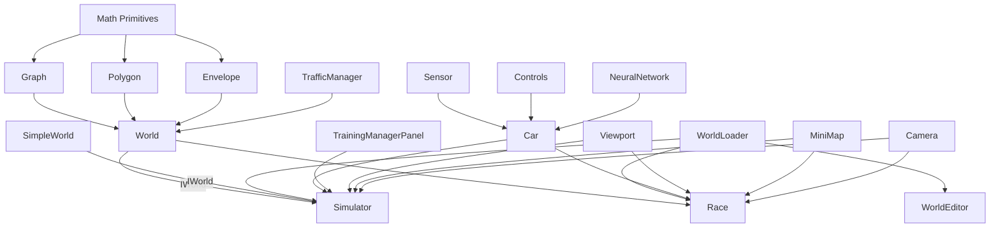

# Project Architecture

## Overview

The Self-Driving Car project is a browser-based autonomous vehicle simulation platform. It demonstrates neuroevolution — evolving neural networks through genetic algorithms to produce cars that learn to navigate procedurally-generated environments.

**Key architectural principles:**

- Zero runtime dependencies — everything implemented from scratch
- No bundler — TypeScript compiles to JS, HTML loads scripts via `<script>` tags
- Global scope — all classes exist as window globals; HTML controls dependency order
- Canvas 2D rendering with custom 3D projection for camera views

---

## Build Pipeline

```
┌──────────────┐     ┌─────────┐     ┌──────────────┐     ┌─────────┐
│  ts/*.ts     │────▶│  tsc    │────▶│  js/*.js     │────▶│ Browser │
│  (source)    │     │ compiler│     │  (output)    │     │ <script>│
└──────────────┘     └─────────┘     └──────────────┘     └─────────┘
```

- `tsc --watch` recompiles on save
- `serve -p 9090` serves the root directory as static files
- HTML files reference `/js/...` paths directly in ordered `<script>` tags
- No import/export at runtime — all code attaches to global scope

### Script Load Order (typical HTML page)

```html
<!-- 1. Math primitives -->
<script src="/js/math/primitives/point.js"></script>
<script src="/js/math/primitives/segment.js"></script>
<script src="/js/math/primitives/polygon.js"></script>
<script src="/js/math/primitives/envelope.js"></script>
<script src="/js/math/graph/graph.js"></script>
<script src="/js/math/utils.js"></script>

<!-- 2. World system -->
<script src="/js/world-editor/world.js"></script>
<script src="/js/world-editor/items/building.js"></script>
<script src="/js/world-editor/items/tree.js"></script>
<script src="/js/world-editor/markings/*.js"></script>
<script src="/js/world-editor/trafficManager.js"></script>

<!-- 3. Viewport & Mini-map -->
<script src="/js/viewport/viewport.js"></script>
<script src="/js/mini-map/miniMap.js"></script>

<!-- 4. Car system -->
<script src="/js/car/sensors/sensor.js"></script>
<script src="/js/car/controls/controls.js"></script>
<script src="/js/car/car.js"></script>

<!-- 5. Neural network -->
<script src="/js/neural-network/network.js"></script>
<script src="/js/neural-network/visualizer.js"></script>

<!-- 6. Custom element panels (must load before DOM parses their tags) -->
<script src="/js/ai-training/topControlsPanel.js"></script>
<script src="/js/ai-training/viewControlsPanel.js"></script>
<script src="/js/ai-training/trainingManagerPanel.js"></script>

<!-- 7. Simulator-specific code -->
<script src="/js/ai-training/simulator.js"></script>

<!-- 8. Inline initialization -->
<script>
  const simulator = new Simulator(canvas, networkCanvas, miniMapCanvas);
</script>
```

---

## Module Dependency Graph



---

## Core Modules

### 1. Mathematical Foundations (`ts/math/`)

The geometric engine powering all spatial operations.

| Module                   | Responsibility                                                |
| ------------------------ | ------------------------------------------------------------- |
| `primitives/point.ts`    | 2D/3D position, drawing, equality checks                      |
| `primitives/segment.ts`  | Line segments, projection, distance, direction vectors        |
| `primitives/polygon.ts`  | Closed shapes, union, intersection, containment (ray casting) |
| `primitives/envelope.ts` | Rounded rectangles around segments (road surfaces)            |
| `graph/graph.ts`         | Point/segment network, Dijkstra shortest path                 |
| `osm-importer/osm.ts`    | OpenStreetMap JSON → Point/Segment conversion                 |
| `utils.ts`               | Vector math, lerp, intersections, rotation, distance          |

### 2. Car System (`ts/car/`)

Vehicle physics, perception, and control abstraction.

| Module                       | Responsibility                                        |
| ---------------------------- | ----------------------------------------------------- |
| `car.ts`                     | Physics simulation, polygon collision, AI integration |
| `sensors/sensor.ts`          | Ray-casting, obstacle detection, normalized readings  |
| `controls/controls.ts`       | Keyboard input, AI/DUMMY modes                        |
| `controls/phoneControls.ts`  | Device orientation (accelerometer tilt)               |
| `controls/cameraControls.ts` | Webcam-based marker steering                          |
| `controls/markerDetector.ts` | K-means blue pixel clustering for markers             |

### 3. Neural Network (`ts/neural-network/`)

The AI brain and its visualization.

| Module          | Responsibility                                        |
| --------------- | ----------------------------------------------------- |
| `network.ts`    | Feedforward network, Level class, mutation, crossover |
| `visualizer.ts` | Real-time rendering of activations, weights, biases   |

### 4. World Editor (`ts/world-editor/`)

Environment generation and interactive editing.

| Module                     | Responsibility                                             |
| -------------------------- | ---------------------------------------------------------- |
| `world.ts`                 | Road generation, building/tree placement, corridor paths   |
| `trafficManager.ts`        | Traffic light cycling and intersection coordination        |
| `editors/worldEditor.ts`   | Master editor coordinator                                  |
| `editors/graphEditor.ts`   | Road network point/segment manipulation                    |
| `editors/markingEditor.ts` | Base class for all marking placement tools                 |
| `editors/*Editor.ts`       | Specialized editors (light, stop, start, target, etc.)     |
| `items/building.ts`        | 3D building rendering with perspective                     |
| `items/tree.ts`            | Procedural multi-level tree with noisy canopy              |
| `markings/*.ts`            | Traffic marking types (start, stop, light, crossing, etc.) |

### 5. Simulators & Training (`ts/ai-training/`, `ts/simple-world/`)

Training environments and genetic algorithm orchestration.

| Module                    | Responsibility                                                                 |
| ------------------------- | ------------------------------------------------------------------------------ |
| `trainingManagerPanel.ts` | Custom element: training UI + genetic algorithm orchestration + car generation |
| `topControlsPanel.ts`     | Custom element: border mode, tracking mode, world loader controls              |
| `viewControlsPanel.ts`    | Custom element: layout toggle, camera/visualizer/minimap visibility            |
| `simulator.ts`            | Unified simulator: world mode (default) + simple mode (`?mode=simple`)         |
| `trafficGenerator.ts`     | Traffic row generation for simple mode (extracted, generic via `IWorld`)       |
| `simulatorUtils.ts`       | Shared car drawing with pool highlighting + collision response utility         |
| `simpleWorld.ts`          | Lightweight `IWorld` implementation: straight 3-lane road with lane helpers    |

**`<training-manager-panel>`** is the single source of truth for training state:

- Custom HTML element (`TrainingManagerPanelElement`) that owns both UI and logic
- Owns `cars[]`, `bestCar`, `bestPool`
- Generates cars internally (simulators provide only `getStartInfo(): {x, y, angle}`)
- Configured at runtime via `element.configure(options)` with callbacks
- Manages two distinct operations:
  - **Next Generation** (🧬) — keeps top brains from current pool, mutates the rest
  - **New Training** (🔄) — resets to generation 0 with no brains (fresh start)
- Auto-triggers new training when car parameters (speed, rays, etc.) change
- Handles brain persistence (save/load/discard from localStorage and .car files)

### 5b. Reusable Loaders (`ts/world-loader/`, `ts/car-loader/`)

| Module                    | Responsibility                                               |
| ------------------------- | ------------------------------------------------------------ |
| `worldLoader.ts`          | Reusable file-input handler for loading `.world` files       |
| `car-loader/carLoader.ts` | Reusable file-input handler for loading `.car`/`.json` files |

#### WorldLoader

Shared utility used by all pages that support loading world files. It:

- Binds to an existing `#loadWorldInput` element by ID (or creates one at top-left corner)
- Reads the file, extracts JSON from `World.load({...})` format via `indexOf("(")`/`lastIndexOf(")")`, or accepts raw JSON
- Invokes a callback with the parsed world data

> **Important:** `.world` files use the format `const world = World.load({...});`. Do NOT re-implement parsing — always reuse `WorldLoader`.

Usage: `new WorldLoader((worldInfo) => this.#initializeXxx(worldInfo))`

#### CarLoader

Shared utility for loading one or more `.car`/`.json` files. It:

- Binds to an existing `#loadCarInput` element by ID (or creates a hidden one)
- Supports `multiple` file selection
- Parses both pure JSON and assignment syntax (`let carInfo = {...};`)
- Invokes callback with `CarInfo[]` array of all successfully parsed files
- Provides static helpers: `CarLoader.parseCarFile(content)`, `CarLoader.allParamsMatch(cars)`, `CarLoader.compareCarParams(a, b)`

Usage: `new CarLoader((carInfos: CarInfo[]) => this.#handleCarsLoaded(carInfos))`

#### Integration with TopControlsPanel

Both loaders bind by element ID (`#loadWorldInput`, `#loadCarInput`). The `<top-controls-panel>` custom element contains both inputs in its template, so when it's present in the DOM, simply instantiate `new WorldLoader(...)` and `new CarLoader(...)` — they will find and attach to the panel's inputs automatically. No custom event handling or file parsing is needed.

### 6. Viewport & Rendering (`ts/viewport/`, `ts/mini-map/`, `ts/camera/`)

View transformation and display systems.

| Module                 | Responsibility                                                   |
| ---------------------- | ---------------------------------------------------------------- |
| `viewport/viewport.ts` | Zoom, pan, coordinate transformation                             |
| `mini-map/miniMap.ts`  | Scaled overview of world and cars                                |
| `camera/types.ts`      | Camera interfaces (`ICameraPoint`, `ICameraRenderOptions`, etc.) |
| `camera/extrusion.ts`  | 3D extrusion helpers (buildings, cars, trees)                    |
| `camera/camera.ts`     | Frustum-based perspective projection & rendering                 |

### 7. Games & Utilities (`ts/games/`, `ts/`)

Racing mode and shared helpers.

| Module          | Responsibility                                |
| --------------- | --------------------------------------------- |
| `games/race.ts` | Racing with countdown, progress, AI opponents |
| `sound.ts`      | Audio synthesis (engine, beep, explosion)     |
| `utils.ts`      | `polysIntersect`, `getRGBA`, `getRandomColor` |
| `types.ts`      | Global type declarations                      |

---

## Data Flow

### Training Loop (Per Frame)

```
Sensor.update()
    │
    ▼
rays[] ──intersect──▶ roadBorders, buildings, cars
    │
    ▼
readings[] (normalized 0-1 offsets)
    │
    ▼
NeuralNetwork.feedForward(readings + speed)
    │
    ▼
outputs[4] (binary: forward, left, right, reverse)
    │
    ▼
Car.#move() ── physics update ──▶ new position/angle
    │
    ▼
Car.#assessDamage() ── polygon intersection ──▶ damaged?
    │
    ▼
TrainingManager.updateBestCarAndPool()
    │
    ▼
fitness = distance traveled along corridor
```

### Generation Cycle

```
1. trainingManager.initializeCars() → uses getStartInfo() + car config from UI
2. Apply brains from pool (top K unmodified, rest mutated)
3. applyCarSettingsToCars() → ensure physics/sensors match UI config
4. onCarsCreated() → simulator updates references (world.cars, miniMap, etc.)
5. animate() loop → all cars drive simultaneously
6. Cars crash → marked damaged, stop updating
7. All dead or user clicks:
   - "Next Gen" (🧬) → nextGeneration() → top K pool + mutations
   - "New Train" (🔄) → newTraining() → generation 0, no brains
8. Top K cars → bestPool[] (tracked per frame)
9. Save: brains + full CarInfo to localStorage
```

### Car Parameter Changes

When any car config input changes (maxSpeed, acceleration, friction, width, height,
rayCount, rayLength, raySpread, rayOffset), TrainingManager automatically calls
`newTraining()` — this ensures the neural network input layer matches the new sensor
configuration and physics are consistent from generation 0.

### Loading Car Files

When a `.car` file is loaded:

1. Car settings UI is updated
2. If the file contains a brain → stored to localStorage
3. If no brain → stored brains are cleared
4. `newTraining()` is triggered (fresh start with new config)

---

## Persistence Layer

### LocalStorage Keys

| Key           | Content                                                    |
| ------------- | ---------------------------------------------------------- |
| `bestBrain`   | JSON of single top-performing `NeuralNetwork`              |
| `bestBrains`  | JSON array of top K networks (breeding pool)               |
| `bestCarInfo` | JSON `CarInfo` object (physics, size, sensors, best brain) |
| `world`       | JSON world state (used by some pages as fallback)          |

### File System (saves/)

- `.world` files — Complete world state (graph, roads, buildings, markings, viewport)
- `.car` files — Car configuration as plain JSON (`CarInfo` object: brain, physics, sensors, size)
- `.json` files — Raw OpenStreetMap data for import

### Serialization Format

World files use JavaScript variable assignment syntax:

```javascript
const worldVariable = ({ graph: {...}, roadWidth: 100, ... })
```

Parsed at load time via regex extraction + `JSON.parse()`.

Car files (`.car`) are saved as plain JSON objects:

```json
{
  "maxSpeed": 8,
  "acceleration": 0.08,
  "friction": 0.04,
  "width": 30,
  "height": 50,
  "sensor": { "rayCount": 2, "rayLength": 350, "raySpread": 0.8, "rayOffset": -0.4 },
  "brain": { "levels": [...] }
}
```

Legacy `.car` files using `let carInfo = {...}` format are also supported for loading (backward compatibility).

---

## HTML Entry Points

Each HTML file is a standalone application that loads the required subset of modules:

| File             | Modules Loaded                                                                           | Purpose                     |
| ---------------- | ---------------------------------------------------------------------------------------- | --------------------------- |
| `index.html`     | None (links only)                                                                        | Landing page                |
| `simulator.html` | Full stack + SimpleWorld + TrafficGenerator                                              | All training modes          |
| `race.html`      | Full stack + Race + SimUtils + WorldLoader + CarLoader + TopControlsPanel + All Controls | All race modes (URL params) |
| `world.html`     | World + Editors + Viewport + WorldLoader                                                 | Map creation                |

---

## Design Patterns

- **Custom HTML Elements** — UI panels (`<training-manager-panel>`, `<top-controls-panel>`, `<view-controls-panel>`) are self-contained custom elements that own their template, DOM queries, event listeners, and exposed state
- **Composition over inheritance** — Cars contain Sensors, Controls, and NeuralNetworks as separate objects
- **Static factory methods** — `World.load()`, `Graph.load()`, `Marking.load()` for deserialization
- **Painter's algorithm** — 3D objects sorted by distance and drawn back-to-front
- **Genetic pool breeding** — Top K parents produce offspring via random gene selection + mutation
- **Ray casting** — Both sensor perception and point-in-polygon testing use ray intersection
- **Envelope wrapping** — Roads generated by wrapping graph segments in rounded polygons, then unioning
