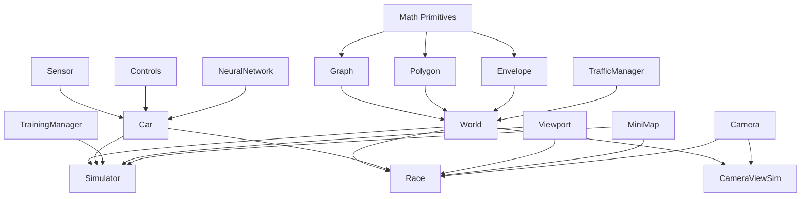

# Project Architecture

## Overview

The Self-Driving Car project is a browser-based autonomous vehicle simulation platform. It demonstrates neuroevolution — evolving neural networks through genetic algorithms to produce cars that learn to navigate procedurally-generated environments.

**Key architectural principles:**

- Zero runtime dependencies — everything implemented from scratch
- No bundler — TypeScript compiles to JS, HTML loads scripts via `<script>` tags
- Global scope — all classes exist as window globals; HTML controls dependency order
- Canvas 2D rendering with custom 3D projection for camera views

---

## Build Pipeline

```
┌──────────────┐     ┌─────────┐     ┌──────────────┐     ┌─────────┐
│  ts/*.ts     │────▶│  tsc    │────▶│  js/*.js     │────▶│ Browser │
│  (source)    │     │ compiler│     │  (output)    │     │ <script>│
└──────────────┘     └─────────┘     └──────────────┘     └─────────┘
```

- `tsc --watch` recompiles on save
- `serve -p 9090` serves the root directory as static files
- HTML files reference `/js/...` paths directly in ordered `<script>` tags
- No import/export at runtime — all code attaches to global scope

### Script Load Order (typical HTML page)

```html
<!-- 1. Math primitives -->
<script src="/js/math/primitives/point.js"></script>
<script src="/js/math/primitives/segment.js"></script>
<script src="/js/math/primitives/polygon.js"></script>
<script src="/js/math/primitives/envelope.js"></script>
<script src="/js/math/graph/graph.js"></script>
<script src="/js/math/utils.js"></script>

<!-- 2. World system -->
<script src="/js/world-editor/world.js"></script>
<script src="/js/world-editor/items/building.js"></script>
<script src="/js/world-editor/items/tree.js"></script>
<script src="/js/world-editor/markings/*.js"></script>
<script src="/js/world-editor/trafficManager.js"></script>

<!-- 3. Viewport & Mini-map -->
<script src="/js/viewport/viewport.js"></script>
<script src="/js/mini-map/miniMap.js"></script>

<!-- 4. Car system -->
<script src="/js/car/sensors/sensor.js"></script>
<script src="/js/car/controls/controls.js"></script>
<script src="/js/car/car.js"></script>

<!-- 5. Neural network -->
<script src="/js/neural-network/network.js"></script>
<script src="/js/neural-network/visualizer.js"></script>

<!-- 6. Simulator-specific code -->
<script src="/js/ai-training/trainingManager.js"></script>
<script src="/js/ai-training/simulator.js"></script>

<!-- 7. Inline initialization -->
<script>
  const simulator = new Simulator(canvas, networkCanvas, miniMapCanvas);
</script>
```

---

## Module Dependency Graph



---

## Core Modules

### 1. Mathematical Foundations (`ts/math/`)

The geometric engine powering all spatial operations.

| Module                   | Responsibility                                                |
| ------------------------ | ------------------------------------------------------------- |
| `primitives/point.ts`    | 2D/3D position, drawing, equality checks                      |
| `primitives/segment.ts`  | Line segments, projection, distance, direction vectors        |
| `primitives/polygon.ts`  | Closed shapes, union, intersection, containment (ray casting) |
| `primitives/envelope.ts` | Rounded rectangles around segments (road surfaces)            |
| `graph/graph.ts`         | Point/segment network, Dijkstra shortest path                 |
| `osm-importer/osm.ts`    | OpenStreetMap JSON → Point/Segment conversion                 |
| `utils.ts`               | Vector math, lerp, intersections, rotation, distance          |

### 2. Car System (`ts/car/`)

Vehicle physics, perception, and control abstraction.

| Module                       | Responsibility                                        |
| ---------------------------- | ----------------------------------------------------- |
| `car.ts`                     | Physics simulation, polygon collision, AI integration |
| `sensors/sensor.ts`          | Ray-casting, obstacle detection, normalized readings  |
| `controls/controls.ts`       | Keyboard input, AI/DUMMY modes                        |
| `controls/phoneControls.ts`  | Device orientation (accelerometer tilt)               |
| `controls/cameraControls.ts` | Webcam-based marker steering                          |
| `controls/markerDetector.ts` | K-means blue pixel clustering for markers             |

### 3. Neural Network (`ts/neural-network/`)

The AI brain and its visualization.

| Module          | Responsibility                                        |
| --------------- | ----------------------------------------------------- |
| `network.ts`    | Feedforward network, Level class, mutation, crossover |
| `visualizer.ts` | Real-time rendering of activations, weights, biases   |

### 4. World Editor (`ts/world-editor/`)

Environment generation and interactive editing.

| Module                     | Responsibility                                             |
| -------------------------- | ---------------------------------------------------------- |
| `world.ts`                 | Road generation, building/tree placement, corridor paths   |
| `trafficManager.ts`        | Traffic light cycling and intersection coordination        |
| `editors/worldEditor.ts`   | Master editor coordinator                                  |
| `editors/graphEditor.ts`   | Road network point/segment manipulation                    |
| `editors/markingEditor.ts` | Base class for all marking placement tools                 |
| `editors/*Editor.ts`       | Specialized editors (light, stop, start, target, etc.)     |
| `items/building.ts`        | 3D building rendering with perspective                     |
| `items/tree.ts`            | Procedural multi-level tree with noisy canopy              |
| `markings/*.ts`            | Traffic marking types (start, stop, light, crossing, etc.) |

### 5. Simulators & Training (`ts/ai-training/`, `ts/simulators/`)

Training environments and genetic algorithm orchestration.

| Module                   | Responsibility                                           |
| ------------------------ | -------------------------------------------------------- |
| `trainingManager.ts`     | Population management, fitness evaluation, pool breeding |
| `simulator.ts`           | Full-world training with custom maps                     |
| `simpleRoadSimulator.ts` | Straight 3-lane road with random traffic                 |
| `simulatorUtils.ts`      | Shared car drawing with pool highlighting                |
| `cameraViewSimulator.ts` | 3D perspective training environment                      |

### 6. Viewport & Rendering (`ts/viewport/`, `ts/mini-map/`, `ts/camera.ts`)

View transformation and display systems.

| Module                 | Responsibility                          |
| ---------------------- | --------------------------------------- |
| `viewport/viewport.ts` | Zoom, pan, coordinate transformation    |
| `mini-map/miniMap.ts`  | Scaled overview of world and cars       |
| `camera.ts`            | 3D frustum-based perspective projection |
| `camera_new_ai_ver.ts` | Experimental AI-oriented camera (WIP)   |

### 7. Games & Utilities (`ts/games/`, `ts/`)

Racing mode and shared helpers.

| Module          | Responsibility                                |
| --------------- | --------------------------------------------- |
| `games/race.ts` | Racing with countdown, progress, AI opponents |
| `sound.ts`      | Audio synthesis (engine, beep, explosion)     |
| `road.ts`       | Simple straight road for basic simulator      |
| `utils.ts`      | `polysIntersect`, `getRGBA`, `getRandomColor` |
| `types.ts`      | Global type declarations                      |

---

## Data Flow

### Training Loop (Per Frame)

```
Sensor.update()
    │
    ▼
rays[] ──intersect──▶ roadBorders, buildings, cars
    │
    ▼
readings[] (normalized 0-1 offsets)
    │
    ▼
NeuralNetwork.feedForward(readings + speed)
    │
    ▼
outputs[4] (binary: forward, left, right, reverse)
    │
    ▼
Car.#move() ── physics update ──▶ new position/angle
    │
    ▼
Car.#assessDamage() ── polygon intersection ──▶ damaged?
    │
    ▼
TrainingManager.updateBestCarAndPool()
    │
    ▼
fitness = distance traveled along corridor
```

### Generation Cycle

```
1. generateCars(N) → each gets mutated brain from pool
2. animate() loop → all cars drive simultaneously
3. Cars crash → marked damaged, stop updating
4. All dead or timeout → evaluate fitness
5. Top K cars → bestPool[]
6. Save bestBrain to localStorage
7. restart() → new generation from pool + mutations
```

---

## Persistence Layer

### LocalStorage

- `bestBrain` — JSON of single top-performing `NeuralNetwork`
- `bestBrains` — JSON array of top K networks (breeding pool)

### File System (saves/)

- `.world` files — Complete world state (graph, roads, buildings, markings, viewport)
- `.car` files — Car configuration (brain, physics params, sensor config)
- `.json` files — Raw OpenStreetMap data for import

### Serialization Format

World and car files use JavaScript variable assignment syntax:

```javascript
const worldVariable = ({ graph: {...}, roadWidth: 100, ... })
```

Parsed at load time via regex extraction + `JSON.parse()` or `eval()`.

---

## HTML Entry Points

Each HTML file is a standalone application that loads the required subset of modules:

| File                       | Modules Loaded                      | Purpose              |
| -------------------------- | ----------------------------------- | -------------------- |
| `index.html`               | None (links only)                   | Landing page         |
| `simpleRoadSimulator.html` | Car, Network, Road, TrainingManager | Basic training       |
| `simulator.html`           | Full stack                          | World-based training |
| `cameraViewSimulator.html` | Full stack + Camera                 | 3D perspective       |
| `race.html`                | Full stack + Race + Camera          | Keyboard racing      |
| `race-camera.html`         | Full + CameraControls               | Webcam racing        |
| `race-phone.html`          | Full + PhoneControls                | Mobile racing        |
| `world.html`               | World + Editors + Viewport          | Map creation         |
| `controlPanel.html`        | N/A (loaded via XHR)                | Reusable training UI |

---

## Design Patterns

- **Composition over inheritance** — Cars contain Sensors, Controls, and NeuralNetworks as separate objects
- **Static factory methods** — `World.load()`, `Graph.load()`, `Marking.load()` for deserialization
- **Painter's algorithm** — 3D objects sorted by distance and drawn back-to-front
- **Genetic pool breeding** — Top K parents produce offspring via random gene selection + mutation
- **Ray casting** — Both sensor perception and point-in-polygon testing use ray intersection
- **Envelope wrapping** — Roads generated by wrapping graph segments in rounded polygons, then unioning
